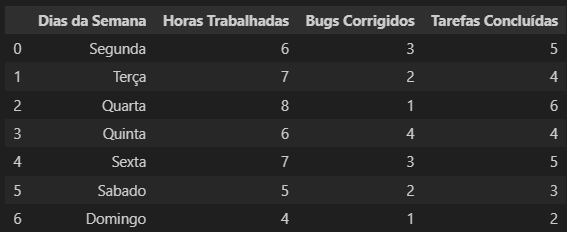
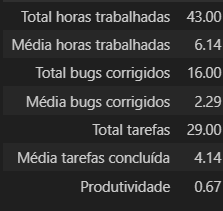

#  Relatórios de Progresso
---

 ## Neste módulo do curso de Analista de dados da Resilia, no  módulo Análise e visualização de dados. Fui desafiado a por em prática as habilidades adquiridas com seguinte desafio.

 Uma empresa de desenvolvimento de softwares possui uma tabela com os alguns dados e deseja um relatório  que você irá ajudar a construir!

- Este relatório tem o objetivo de demonstrar a importância da análise dos dados de um
projeto de desenvolvimento de software ao longo de uma semana. Os dados fornecidos
permitirão ao proprietário da equipe de desenvolvimento obter insights sobre o progresso
do projeto, identificar possíveis áreas de melhoria e tomar decisões informadas para
garantir o sucesso do projeto.
---
- Para vizualizar o projeto você deve Utilizar Jupyter Notebook ou  Google Colab e fazer a importação do arquivo analise_de_dados.ipynb
--- 
- Durante o desenvolvimento do projeto foi utilizada a linguagem de programação python com a biblioteca Pandas,
tambem utilizei a metodologia de organização Kanban, Google Colab pra desenvolver o codigo e Git/GitHub para versionamento e armaazenar os arquivos
no desenvolver do projeto primeiro criei uma tabela pra visualizar todos os dados:
 

---
- Logo apos organizar os dados em DataFrame utilizei funções para ir pegano as informações como soma e média de todos as horas trabalhadas, bugs Corrigidos e outros dados. 
Depois juntei todas as informações em uma tablea e organizei para extrair dados que podem ser usados como insights 

- E alguns insights que consegui observar com os dados tratados foram:

**Na segunda-feira, foi bem produtiva, com os índices de correção de bugs e trabalhos concluídos acima da média, mesmo com horas trabalhadas abaixo da média.**

**Aos domingos, não é tão produtivo, pois todos os seus números estão abaixo da média.**

**Pode diminuir as horas trabalhadas na Quarta e aumentar no Domingo e comparar os resultados futuros com novas análises, já que o Domingo não teve um bom desempenho. O que pode estar trazendo essa performance ruim pode ser a carga horária muito abaixo da média.**

---

Meios de contato:

- [Email](ra-fa0605@hotmail.com)

- [LinkedIn](https://www.linkedin.com/in/rafael-antonio-759a04241/)         

- [GitHub](https://github.com/seu_usuario_do_github)

- [WhatsApp](https://api.whatsapp.com/send?phone=5521982493342)

